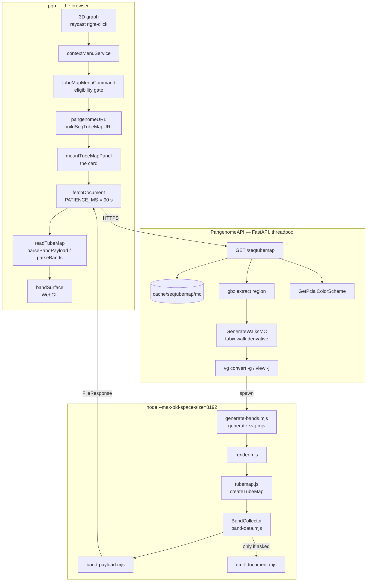
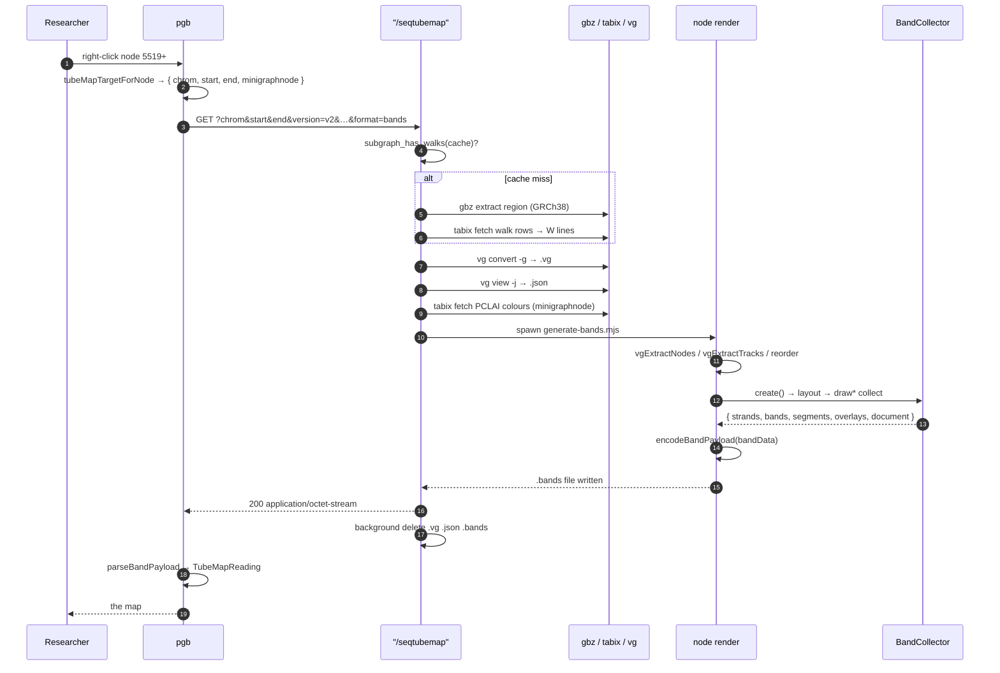
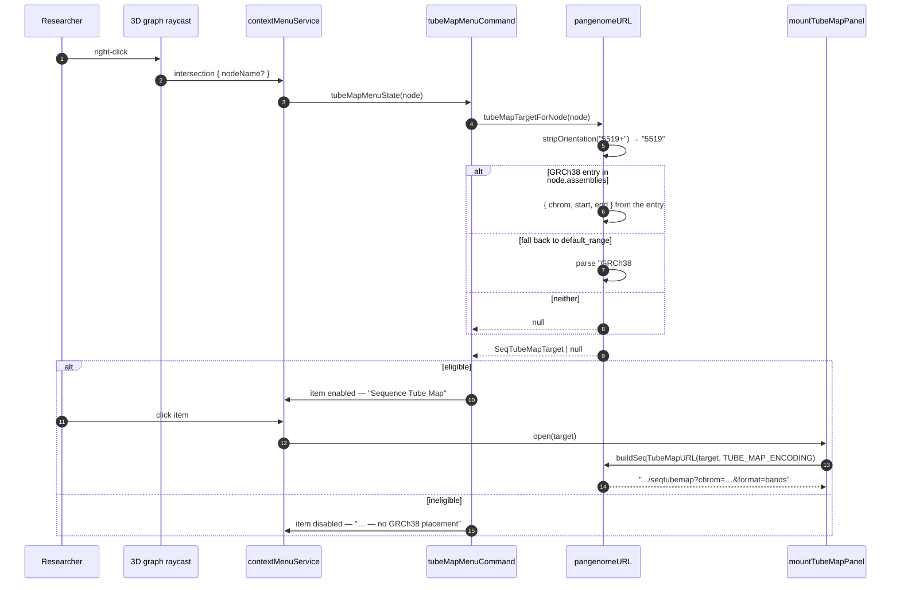
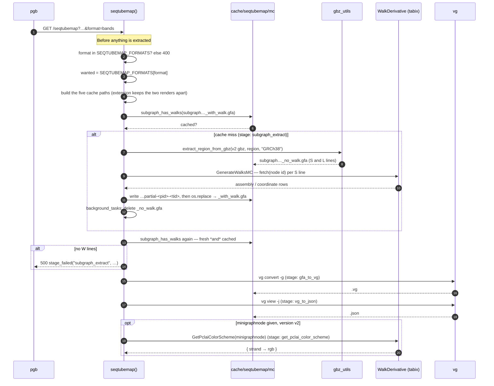
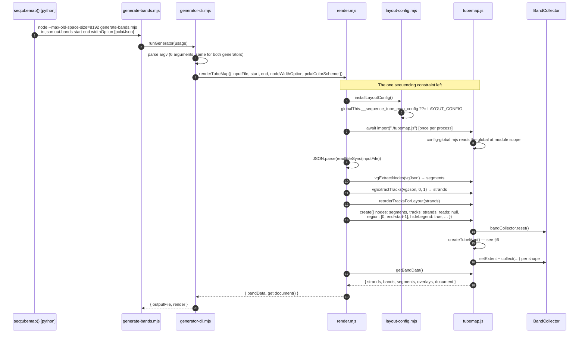
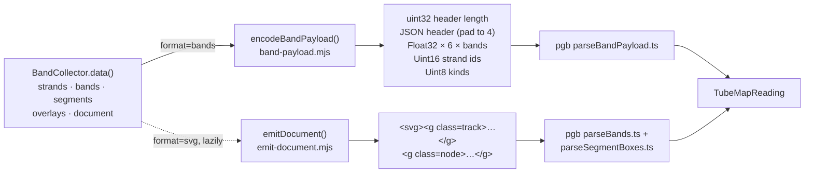
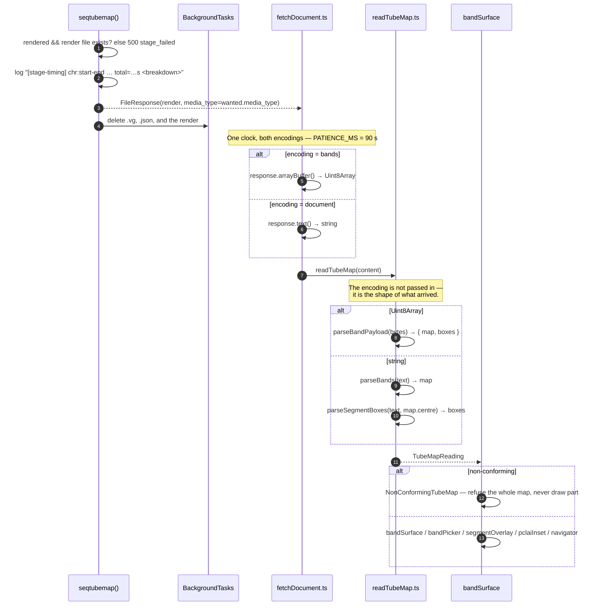

# Sequence Tube Map — Interaction Diagrams

The route a **sequence tube map** travels, from a right-click on a **node** in the
`pgb` 3D graph to the bytes that answer it. Two repositories, three processes and
five file formats sit between those two events, and this document is the map of
them.

It is written against the pipeline as it stands after the seqtubemap refactor —
the invisible browser deleted (#22), the geometry collected as numbers (#21, #23),
and the **band payload** served as an additive second encoding (#24). Vocabulary is
[`CONTEXT.md`](../CONTEXT.md): the coarse thing clicked in 3D is a **node**, the fine
vertices inside the map are **segments**, a haplotype's route is a **strand**, and one
strand crossing one x-interval is a **band**.

---

## 1. Architecture Overview

Three processes, in two repositories, with one HTTP hop and one `spawn` between them.

| Component | Repo | Role |
|---|---|---|
| **contextMenuService** | `pgb` | Right-click hook on the 3D graph; presents the menu |
| **tubeMapMenuCommand** | `pgb` | Eligibility gate + the one panel's lifetime |
| **pangenomeURL** | `pgb` | A clicked node becomes a `/seqtubemap?…` string |
| **mountTubeMapPanel** | `pgb` | The floating card; `open(target)` is its whole surface |
| **fetchDocument** | `pgb` | One fetch, one 90 s clock, text or bytes |
| **readTubeMap** | `pgb` | A response becomes a `TubeMapReading`; the only place that knows there are two encodings |
| **`GET /seqtubemap`** | `PangenomeAPI` | The endpoint: cache, extract, convert, render, respond |
| **gbz / tabix derivatives** | `PangenomeAPI` | `hprc-v2.0-mc-grch38.gbz`, the walk files |
| **`vg`** | external | `convert -g`, `view -j` |
| **render.mjs** | `PangenomeAPI` | The Node render, in-process, no browser |
| **tubemap.js** | `PangenomeAPI` | The layout engine; its draw functions collect rather than draw |
| **band-data.mjs** | `PangenomeAPI` | `BandCollector` — the only description of the picture there is |
| **band-payload.mjs** | `PangenomeAPI` | The wire format: JSON header + columnar binary body |
| **emit-document.mjs** | `PangenomeAPI` | The SVG sink, written from the same band data |



### The one seam that matters

Everything above the `BandCollector` computes numbers. Everything below it
encodes them. The document and the payload are **two sinks over one collector** —
the picture cannot disagree with itself, because there is only one of it
([ADR 0001](./adr/0001-additive-band-format.md)).

---

## 2. End to End — the whole route, compressed



---

## 3. The Click — a node becomes a URL

The click never reaches the network directly. It reaches a **gate**, and the gate is
not optional: the API answers an unknown `minigraphnode` with **200 and a
plausible-looking map of different data**, so an ineligible node has to be stopped
here or not at all.



### What is fixed in the URL, and why

| Parameter | Value | Why it is sent |
|---|---|---|
| `chrom`, `start`, `end` | the node's GRCh38 interval | the **region** — the address of every request |
| `minigraphnode` | bare id, `5519` not `5519+` | enables PCLAI colouring; unknown ids are **not** rejected |
| `version` | `v2` | already the default; an unpinned default is one that can move |
| `pathnumoption` | `normal` | only its *presence* is load-bearing — drop it and 369 strands become 46 |
| `nodewidthoption` | `compressed` | already the default; an unrecognised value is a 500 |
| `format` | `bands`, appended last | the only one that varies; a flag, never a fallback |

> **Why a flag and not a fallback.** The API's failures arrive at 33–100 s with no
> CORS headers, indistinguishable in the browser from a network error. A
> fallback would spend up to ninety seconds before the second request began, on
> exactly the large nodes the whole effort exists for. `TUBE_MAP_ENCODING` was
> flipped to `'bands'` on 2026-09-02.

---

## 4. The Endpoint — region to vg JSON

The handler is **synchronous on purpose**: it blocks, so it belongs in FastAPI's
threadpool rather than on the event loop.



### Why the cache check is a content check

A cache hit is *a subgraph with walks in it*, not merely a file at the path. The
`W` lines are written last, after every `S` and `L`, so an extraction that died
partway leaves a structurally valid GFA describing a graph with **no paths in
it** — which every downstream stage then fails on, each for a reason further from
the cause. `subgraph_has_walks` plus the atomic `os.replace` is what turns that
into one retry.

### Why `WalkDerivative` is per-thread

A `pysam.TabixFile` is one htslib handle with one seek position, and `fetch`
returns a *lazy* iterator — `GenerateWalksMC` holds one open per `S` line, for
minutes on a large region. Endpoints run in the threadpool, so two requests
really do overlap; sharing one handle interleaved the seeks and left it broken
for the life of the process. `threading.local` gives each threadpool thread its
own.

---

## 5. The Render — vg JSON to band data

One `node` process, no browser. `jsdom` and `canvas` are gone from the dependency
tree; the layout's draw functions **collect** what they were about to draw.



> **`render` is handed over whole rather than spread.** `document` is a memoized
> getter — spreading the object would build a document for the generator that does
> not want one, which on a large region is up to 12.58 MB of string that nothing
> then reads.

---

## 6. Inside `createTubeMap` — layout, then collection

The layout is a fixed sequence of passes over the **segments** and **strands**,
ending in draw calls. What was once a DOM append is now a `collect`.

```mermaid
%%{init: {'themeVariables': {'fontSize': '16px'}}}%%
sequenceDiagram
    autonumber
    participant TM as createTubeMap()
    participant BC as BandCollector

    TM->>BC: reset() — and clear every shape list
    TM->>TM: straightenTrack(0) — the pivot strand fixes orientation
    TM->>TM: deepCopy nodes / tracks; drop hidden strands
    TM->>TM: generateNodeMap · generateTrackIndexSequences · generateNodeWidth

    Note over TM: Order and orientation
    TM->>TM: generateNodeSuccessors → generateNodeDegree → generateNodeOrder
    TM->>TM: switchNodeOrientation → generateNodeOrder (again)
    TM->>TM: calculateTrackWidth → generateLaneAssignment
    TM->>TM: generateNodeXCoords
    TM->>TM: generateSVGShapesFromPath(nodes, tracks)

    Note over TM: Extent, then draw order = paint order = document order
    TM->>TM: getImageDimensions()
    TM->>BC: setExtent({ maxX, maxY, minY })

    TM->>BC: drawTrackRectangles(haplotype) → rectBand ×N
    TM->>BC: drawTrackCurves(haplotype) → curveBand ×N
    TM->>BC: drawReversalsByColor → cornerShape / verticalConnector
    TM->>BC: drawTrackRectangles(step 3)
    TM->>BC: drawNodes(dNodes) → segmentBox ×N
    opt nodeWidthOption === "normal"
        TM->>BC: drawLabels → overlays
    end
    opt trackForRuler defined
        TM->>BC: drawRuler → overlays (axis, ticks, labels)
    end
    TM->>BC: assertDenseStrandIds(strands) on data()
```

### The band grammar

A band is **six numbers and a strand id**: `x0, y0`, `x1, y1` — the two ends of the
upper edge — and `controlTop`, `controlBottom`, the control abscissae of the two
cubics. That is enough only because every band is `BAND_THICKNESS = 15`, measured
across 127,101 strand paths.

| Collected shape | Kind | Carries |
|---|---|---|
| `rectBand` | `rect` | the degenerate band — level, any control abscissa reproduces it |
| `curveBand` | `curve` | the same six values; `kind` says which element the document writes |
| `cornerShape` | `corner` | a quarter turn from quadratics — **outside** the six-value grammar |
| `verticalConnector` | `connector` | as tall as the reversal is deep, not `BAND_THICKNESS` |
| `segmentBox` | — | five numbers: left, top, right, bottom, radius |
| ruler / labels | overlay | element name + ordered attribute pairs; production has none |

Two invariants are checked here rather than downstream, where the layout that
produced them is no longer in scope:

- **Thickness.** A band the layout draws off the grammar throws in `band-data.mjs`,
  not at a client that would refuse the whole document.
- **Dense strand ids.** `createTubeMap` splices hidden strands out *after* ids are
  assigned, so a hole is possible; `assertDenseStrandIds` turns the accident into a
  checked invariant, because `pgb` rejects a whole document whose `trackID`s are not
  exactly `0..n-1`.

---

## 7. Two Sinks, One Collector



| | SVG document | Band payload |
|---|---|---|
| Media type | `image/svg+xml` | `application/octet-stream` |
| Geometry | a `d` attribute parsed back with a regex | `Float32Array` view over the received bytes |
| Per-strand values | re-serialized on every one of ~55,053 bands | once, in the strand table |
| Colour | `rgb(r, g, b)` or hex, parsed client-side | three rounded channels |
| Reversals | drawn inline | header lists, each with its `order` |
| Size, 8,000 bases | ~10 MB | 1.10 MB |
| Built when | first access to `render.document` | always, on the bands route |

Why columnar rather than one record per band: interleaved, a band is a 26-byte
stride, and a `Float32Array` cannot view a buffer at an offset that is not a
multiple of 4. Split into columns, each column is a single typed-array view —
`new Float32Array(buffer, offset, 6 * count)` is the instance buffer, and the
parse step this format exists to delete stays deleted.

---

## 8. The Response — bytes back to a picture



Everything downstream of `readTubeMap` — `bandSurface`, `bandPicker`,
`strandAppearance`, `inversion`, `pclaiInset`, `strandLabel`, `segmentOverlay`,
`navigator` — never learns which route ran.

---

## 9. Stage Timings

Every stage is wrapped in `stage_timing`, and one `[stage-timing]` line per request
carries the breakdown, so latency can be attributed with a `grep`.

| Stage | What it is | Skipped when |
|---|---|---|
| `subgraph_extract` | gbz extract + `GenerateWalksMC` | the cached GFA already has W lines |
| `gfa_to_vg` | `vg convert -g` | never |
| `vg_to_json` | `vg view -j` | never |
| `get_pclai_color_scheme` | tabix fetch over the minigraph v2 walks | no `minigraphnode`, or `version=v1` |
| `generate_svg` / `generate_bands` | the Node render | never — one or the other runs |

Measured through the real endpoint over five real regions, 2026-08-28, before and
after the invisible browser was deleted:

| Region | Was | Now | Faster by |
|---|---|---|---|
| 90 bases | 0.65 s | 0.21 s | 3.0× |
| 600 bases | 0.98 s | 0.28 s | 3.5× |
| 1,400 bases | 1.23 s | 0.33 s | 3.7× |
| 8,000 bases | 2.38 s | 0.74 s | 3.2× |
| 4,200 bases, 1,201 strands | 2.56 s | 0.59 s | 4.3× |

Memory during a render fell from 1,851 MB to 95 MB; peak from 2,446 MB to 473 MB.

---

## 10. Invariants

| Invariant | Where it lives |
|---|---|
| The band data is canonical; the document is a rendering of it | `render.mjs` — one collector, two sinks |
| A cache hit is a subgraph *with walks*, not a file at a path | `subgraph_has_walks`, main.py |
| A half-written subgraph never becomes a cache entry | `GenerateWalksMC` — partial file + `os.replace` |
| One tabix handle per thread | `WalkDerivative._per_thread` |
| The two generators take the same six arguments, by construction | `generator-cli.mjs`, `_render_seq_tube_map` |
| `format` is validated before anything is extracted | `seqtubemap()`, first thing after the region |
| Every band is `BAND_THICKNESS` | `band-data.mjs`, throws otherwise |
| Strand ids are dense `0..n-1` | `assertDenseStrandIds` |
| The document stays byte-compatible with `pgb`'s parser | `tests/node/document-conformance.test.mjs` |
| An ineligible node is stopped in the client, never by the server | `tubeMapTargetForNode` — the API answers 200 either way |
| The viewer never probes for a format; it is told | `TUBE_MAP_ENCODING` |

---

## 11. Source Map

### `PangenomeAPI`

| File | Role |
|---|---|
| `main.py` | `/seqtubemap`, the cache paths, the stage timings, the subprocess invocations |
| `gbz_utils.py` | region extraction from the `.gbz` |
| `seqtubemap/generate-bands.mjs` · `generate-svg.mjs` | the two spawned entry points |
| `seqtubemap/generator-cli.mjs` | the command line both take |
| `seqtubemap/render.mjs` | one render, two products |
| `seqtubemap/layout-config.mjs` | the config `tubemap.js` reads at import time |
| `seqtubemap/tubemap.js` | the layout; draw functions collect |
| `seqtubemap/band-data.mjs` | `BandCollector`, the band grammar, the invariants |
| `seqtubemap/band-payload.mjs` | the wire format |
| `seqtubemap/emit-document.mjs` | the SVG sink |
| `docs/band-format.md` | the spec, written to be enough to write a parser against |
| `docs/adr/0001-additive-band-format.md` | why the format is additive |
| `docs/tube-map-pipeline.html` | the narrative version: what it cost, and where the time went |
| `docs/lexicon.html` | the vocabulary, pointed at on a real map |

### `pgb`

| File | Role |
|---|---|
| `src/contextMenuService.js` | the right-click menu |
| `src/tubeMapMenuCommand.ts` | eligibility, wording, the panel's lifetime |
| `src/pangenomeURL.ts` | target from node, URL from target |
| `src/mountTubeMapPanel.ts` | the card |
| `src/tubemap/fetchDocument.ts` | the fetch, the clock, text-or-bytes |
| `src/tubemap/tubeMapEncoding.ts` | the flag |
| `src/tubemap/readTubeMap.ts` | the only place that knows there are two encodings |
| `src/tubemap/parseBandPayload.ts` · `parseBands.ts` | the two readers |
| `src/tubemap/bandSurface.ts` | the picture |

---

Rendered, with the diagrams redrawn as ruled lifeline charts:
[`seqtubemap-interaction.html`](./seqtubemap-interaction.html), published at
<https://claude.ai/code/artifact/ca74cc4a-c68c-452a-9682-3c8480705b36>.
